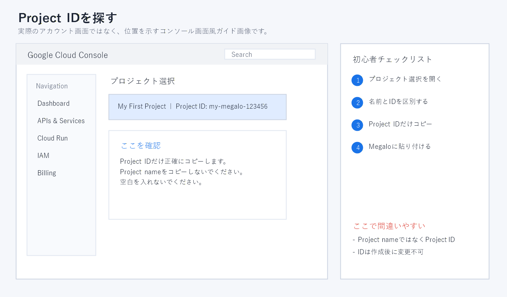
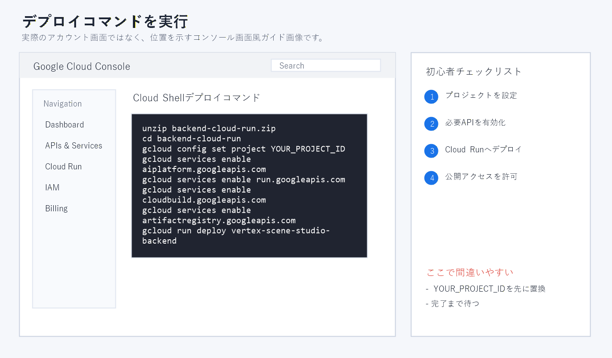
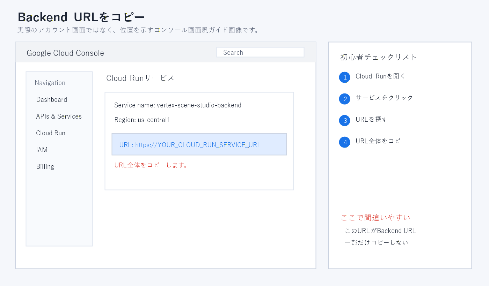

# Megalo Image Generator Pro v1.42 初心者チュートリアル

このガイドはChrome拡張機能、Google Cloud、Vertex AIを初めて使う方を対象としています。

## 1. 使用前の注意

プログラム自体は無料ですが、画像・動画生成は利用者のGoogle Cloudプロジェクトで実行されます。Vertex AIとCloud Runの料金が発生する場合があります。

最初の確認では、参照画像1枚、シーン1個、出力1枚、1Kまたは2Kを使用してください。

## 2. ダウンロードとインストール

このリポジトリの **Releases** から `Megalo_Pro_v1.42_GitHub_Free_protected_20260716.zip` をダウンロードします。GitHubが自動生成する `Source code (zip)` はアプリ本体ではありません。

ZIPを完全に展開してから次の操作を行います。

1. Chromeで `chrome://extensions` を開きます。
2. **デベロッパーモード**を有効にします。
3. **パッケージ化されていない拡張機能を読み込む**を押します。
4. `ja_JP/extension` を選択します。

## 3. Google Cloudの準備

請求先とVertex AIアクセスが設定されたGoogle Cloudプロジェクトが必要です。表示名ではなく **Project ID** を使用してください。



Vertex AI、Cloud Run Admin、Cloud Build、Artifact Registry、Service Usage APIの有効化が必要になる場合があります。

## 4. Cloud Runバックエンドのデプロイ

1. `SCENE`タブを開きます。
2. `Vertex / バックエンド設定`のスロット1を開きます。
3. 別名とProject IDを入力します。
4. 自動再デプロイスクリプトを作成してコピーします。
5. Google Cloud Shellでスクリプトを実行します。



完了後に表示される `https://` から始まるCloud RunサービスURLを、同じスロットのBackend URL欄へ入力します。



## 5. 参照画像

| スロット | 基本役割 |
|---|---|
| 1 | 顔と髪のアイデンティティ |
| 2 | 全身正面と衣装正面 |
| 3 | 側面プロフィールとシルエット |
| 4 | 全身後面と背面ディテール |
| 5 | 顔とコスチュームの補強 |

5枚すべてが必須ではありません。接続確認では顔画像1枚だけでも使用できます。生成前に実際の画像プレビューが表示されていることを確認してください。

## 6. 最初の画像生成

システムプロンプト例:

```text
成人キャラクター1人。アップロードした参照画像と同じ顔と髪型を維持する。
現代的な高解像度の実写写真。文字、ロゴ、透かしなし。
```

シーンプロンプト例:

```text
[シーン] 明るい室内スタジオで成人キャラクターがカメラを見ながら自然に立っている。自然な全身構図、柔らかい照明。
```

画面比率、1Kまたは2K、出力1枚を選択し、最終プロンプトを確認して自動生成を開始します。処理中に生成ボタンを繰り返し押さないでください。

## 7. 結果の保存

`SAVE`タブで結果の確認、並べ替え、再生成、削除、保存ができます。分割画像には自動分割または手動分割を使用します。

## 8. 費用と復元

大量生成前にスロット残高と生成セーフティセンターを設定します。バッチ予算、セッション予算、緊急バックアップを利用してください。

Chromeが異常終了した場合は、ブラウザデータを削除する前にクラッシュ復元と生成履歴を確認します。

## 9. よくあるエラー

- **403:** Vertex AI API、モデルアクセス、Project ID、Cloud Runサービスアカウント権限を確認します。
- **429:** 同時スロット、再試行回数、バッチサイズを減らし、しばらく待ちます。
- **Failed to fetch:** Backend URLとCloud Runサービスの実行状態を確認します。
- **参照の反映が弱い:** 競合する説明を削除し、参照数とシーンの複雑さを減らします。
- **メモリ不足:** 不要なタブを閉じ、小さいバッチに分けて保存後にChromeを再起動します。

## 10. 更新

新しいReleaseは別フォルダーへ展開します。プリセット、キャラクター、参照セット、結果をバックアップしてから拡張機能のフォルダーを切り替えてください。
