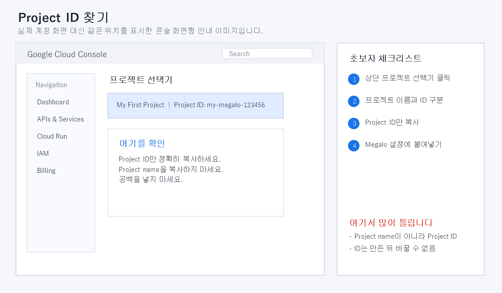
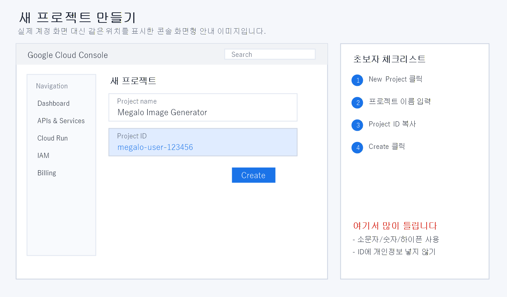
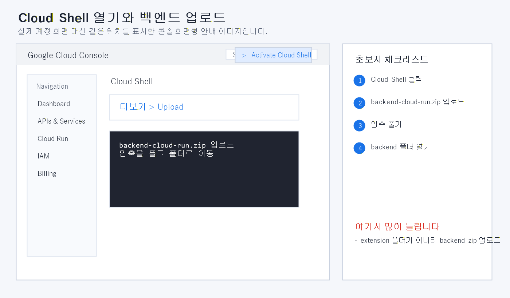
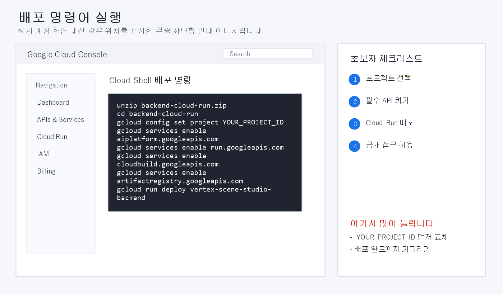
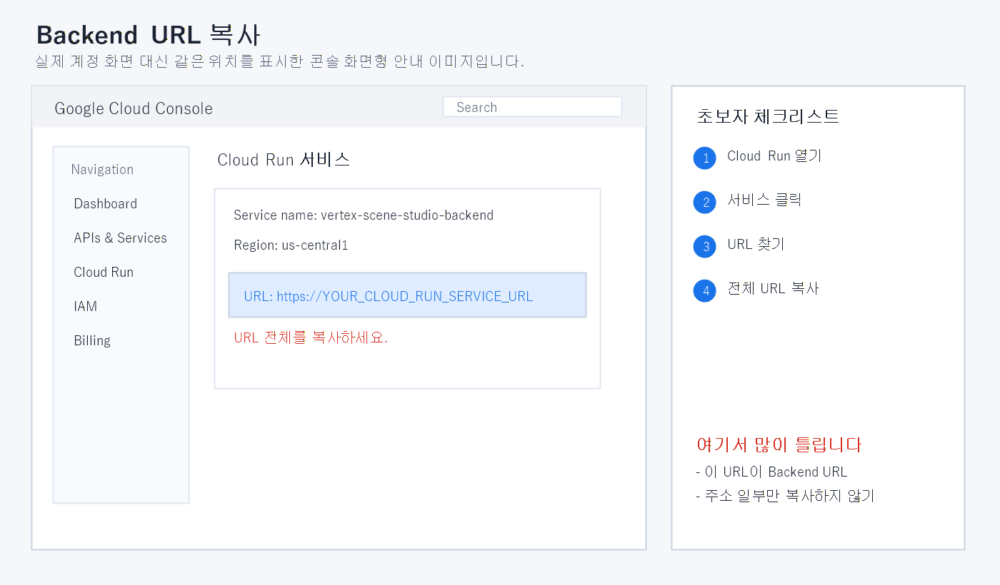
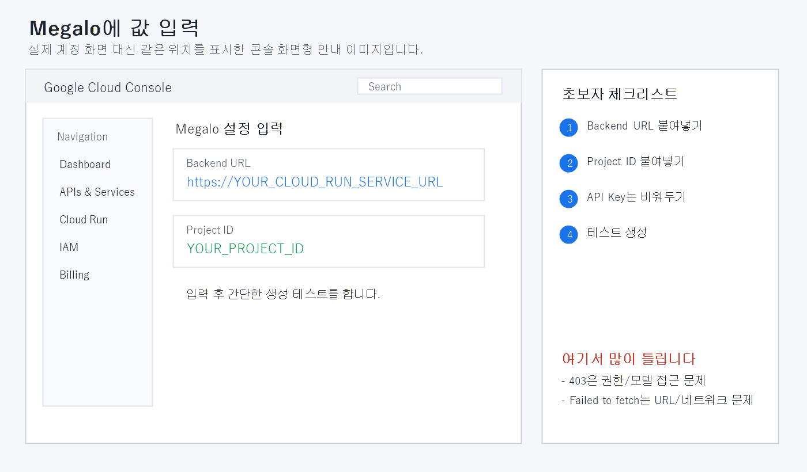

# Megalo Image Generator Pro v1.42 초보자 튜토리얼

이 문서는 Chrome 확장 프로그램과 Google Cloud를 처음 사용하는 사람을 기준으로 작성되었습니다.

## 1. 사용 전에 꼭 알아둘 점

Megalo Image Generator 프로그램은 무료지만 이미지와 동영상 생성은 사용자의 Google Cloud 프로젝트를 통해 실행됩니다. Vertex AI와 Cloud Run 사용료는 사용자 계정에 청구될 수 있습니다.

처음부터 여러 장면을 동시에 생성하지 마세요. 아래 조합으로 연결부터 확인하는 것이 가장 안전합니다.

- 레퍼런스 이미지 1장
- 장면 프롬프트 1개
- 이미지 생성 개수 1장
- 1K 또는 2K 해상도

## 2. 프로그램 내려받기

GitHub 저장소의 **Releases**에서 다음 파일을 받습니다.

`Megalo_Pro_v1.42_GitHub_Free_protected_20260716.zip`

GitHub가 자동으로 표시하는 `Source code (zip)`은 프로그램이 아닙니다. 반드시 이름에 `protected`가 들어간 Release 첨부 파일을 받으세요.

다운로드한 ZIP은 별도 폴더에 완전히 압축 해제합니다. ZIP 내부에서 직접 실행하면 업데이트, 저장, 외부 도구 연결이 정상적으로 작동하지 않을 수 있습니다.

## 3. Chrome에 설치하기

1. Chrome 주소창에 `chrome://extensions`를 입력합니다.
2. 오른쪽 위의 **개발자 모드**를 켭니다.
3. **압축해제된 확장 프로그램을 로드합니다**를 누릅니다.
4. 압축을 푼 폴더의 `ko_KR/extension`을 선택합니다.
5. 확장 프로그램 목록에 Megalo Image Generator가 나타나는지 확인합니다.

다른 언어는 다음 폴더를 선택합니다.

| 언어 | 설치 폴더 |
|---|---|
| 한국어 | `ko_KR/extension` |
| 영어 | `en_US/extension` |
| 일본어 | `ja_JP/extension` |
| 중국어 간체 | `zh_CN/extension` |

업데이트 파일을 기존 폴더에 덮어쓴 경우 `chrome://extensions`에서 해당 확장 프로그램의 새로고침 버튼을 한 번 누릅니다.

## 4. Google Cloud 프로젝트 준비

이미지 생성을 위해 Google Cloud 프로젝트, 결제 계정, Vertex AI 사용 권한이 필요합니다.



프로그램에 입력하는 값은 프로젝트 이름이 아니라 **Project ID**입니다.



처음 사용하는 계정은 다음 서비스의 활성화가 필요할 수 있습니다.

- Vertex AI API
- Cloud Run Admin API
- Cloud Build API
- Artifact Registry API
- Service Usage API

조직이나 회사 계정을 사용한다면 프로젝트 수정과 Vertex AI 호출 권한이 제한될 수 있습니다.

## 5. Cloud Run 백엔드 배포

1. 프로그램의 `SCENE 장면 생성` 탭을 엽니다.
2. `Vertex / 백엔드 설정`에서 1번 슬롯을 펼칩니다.
3. 1번 슬롯의 별칭과 Project ID를 입력합니다.
4. `백엔드 자동 재배포 스크립트 생성기`를 펼칩니다.
5. 자동 재배포 스크립트를 만들고 복사합니다.
6. Google Cloud Shell을 열고 복사한 스크립트를 붙여넣어 실행합니다.





배포가 끝나면 `https://`로 시작하는 Cloud Run 서비스 주소가 출력됩니다.



이 주소를 프로그램의 같은 슬롯 `Backend URL`에 넣습니다.



Project ID와 Backend URL은 반드시 같은 프로젝트의 값이어야 합니다.

## 6. 레퍼런스 이미지 넣기

기본 레퍼런스 역할은 다음과 같습니다.

| 슬롯 | 기본 역할 |
|---|---|
| 1 | 얼굴과 헤어 정체성 |
| 2 | 전신 정면과 의상 정면 |
| 3 | 전신 측면과 측면 실루엣 |
| 4 | 전신 후면과 후면 디테일 |
| 5 | 얼굴과 코스튬 보강 |

5장이 모두 필수는 아닙니다. 1번 얼굴 이미지 한 장만으로도 생성할 수 있습니다. 처음 연결 시험은 1번 슬롯만 사용하는 것을 권장합니다.

레퍼런스 이미지를 올린 뒤 미리보기에 실제 이미지가 표시되는지 확인하세요. 파일명만 표시되고 이미지가 보이지 않으면 생성하기 전에 다시 업로드해야 합니다.

## 7. 첫 이미지 생성

시스템 설정 프롬프트에는 모든 장면에 공통으로 적용할 규칙을 짧게 적습니다.

```text
성인 캐릭터 1명. 업로드한 레퍼런스와 동일한 얼굴과 헤어를 유지.
현대적인 고해상도 실사 사진. 화면 안에 글자, 로고, 워터마크 없음.
```

장면 프롬프트에는 이번 이미지의 행동, 배경, 카메라 구도를 적습니다.

```text
[장면] 밝은 실내 스튜디오에서 성인 캐릭터가 카메라를 바라보며 편안하게 서 있다. 자연스러운 전신 구도, 부드러운 조명.
```

설정 순서는 다음과 같습니다.

1. 화면 비율을 선택합니다.
2. 처음에는 1K 또는 2K를 선택합니다.
3. 이미지 생성 개수를 1로 설정합니다.
4. 장면 1 사용 체크를 확인합니다.
5. 최종 프롬프트 미리보기에서 이전 캐릭터 이름이나 불필요한 문장이 남아 있지 않은지 확인합니다.
6. `입력된 장면 자동 생성 요청`을 누릅니다.

생성 중에는 같은 버튼을 여러 번 누르지 마세요. 새로운 요청으로 처리되면 사용량이 늘어날 수 있습니다.

## 8. 결과 확인과 저장

생성 결과는 `SCENE 장면 생성`의 실시간 결과와 `SAVE 정렬/저장` 탭에서 확인합니다.

- 결과를 클릭하면 확대해서 확인할 수 있습니다.
- 더블클릭하면 새 창에서 원본을 확인할 수 있습니다.
- 잘못 생성된 장면은 해당 장면 재생성을 사용합니다.
- 필요 없는 이미지는 삭제합니다.
- 선택 저장 또는 일괄 저장으로 JPG 파일을 내려받습니다.
- 2분할과 3분할 이미지는 자동 절단 또는 수동 분할 도구를 사용합니다.

## 9. 비용 보호와 크래시 복구

대량 생성 전에는 슬롯별 남은 크레딧과 생성 안전 센터를 설정하세요.

- 배치 최대 비용: 한 번의 생성 묶음에서 허용할 예상 금액
- 세션 최대 비용: 현재 사용 세션의 누적 허용 금액
- 위험 시 자동 백업: 메모리 위험이나 비정상 종료에 대비한 복구 정보 저장

Chrome이 강제 종료되었다면 프로그램을 다시 열어 크래시 복구와 생성 히스토리를 확인합니다. 복구가 끝나기 전에 브라우저 데이터 삭제나 확장 프로그램 삭제를 하지 마세요.

## 10. 자주 발생하는 오류

### 403 권한 오류

Vertex AI API 활성화, 모델 사용 권한, Cloud Run 실행 서비스 계정의 권한, Project ID를 확인합니다.

### 429 할당량 오류

동시 생성 슬롯, 재시도 횟수, 배치 크기를 줄이고 잠시 기다린 뒤 다시 시도합니다. 짧은 시간에 후검열 재시도를 많이 실행하면 429가 발생하기 쉽습니다.

### Failed to fetch

Backend URL이 비어 있거나 잘못되었는지, Cloud Run 서비스가 배포되어 실행 중인지, 서비스 URL 앞뒤에 불필요한 문자가 없는지 확인합니다.

### 레퍼런스가 잘 반영되지 않음

시스템 프롬프트를 짧게 만들고 서로 충돌하는 인물·의상 설명을 제거합니다. 처음에는 레퍼런스 수와 장면 복잡도를 줄여 확인합니다.

### 메모리 부족

불필요한 브라우저 탭을 닫고 작은 배치로 나누어 생성합니다. 결과 저장과 복구 상태를 확인한 뒤 Chrome을 다시 시작합니다.

## 11. 업데이트 방법

1. 새 Release ZIP을 내려받습니다.
2. 기존 프로그램 폴더와 다른 폴더에 압축을 풉니다.
3. 필요한 프리셋과 캐릭터 설정을 백업합니다.
4. 새 폴더로 데이터를 복원합니다.
5. `chrome://extensions`에서 기존 확장 프로그램의 폴더를 교체하거나 다시 로드합니다.

중요한 작업 전에는 항상 프리셋, 캐릭터, 레퍼런스 세트, 생성 결과를 외부 폴더에도 백업하세요.
